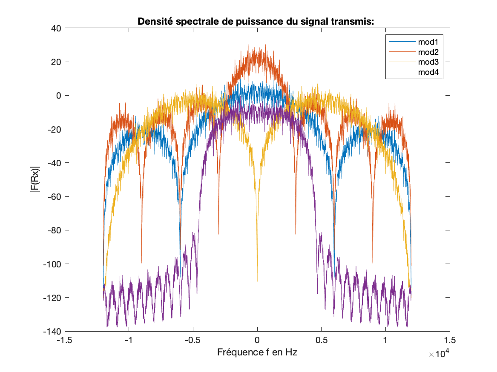

---
# pandoc -s rapport.md -o rapport.pdf --template eisvogel --listings
title: "Rapport - TP1 : Étude de modulateurs bande de base"
subtitle: "Première année - Département Sciences du Numérique"
author: "[Julien Blanchon](mailto:julien.blanchon@etu.toulouse-inp.fr)"
date: "14 Février 2020"
keywords: [telecom, matlab, signal]
lang: "fr-FR"
titlepage: true,
titlepage-rule-color: "360049"
titlepage-rule-height: 13
#titlepage-background: "~/Documents/backgrounds/background3.pdf"
#logo: "figures/inp-enseeiht.png"
#logo-width: 65mm
#page-background: "~/Documents/backgrounds/background1.pdf"

base: . %Base directory for import file

header-left: "\\hspace{1cm}"
header-center: "\\leftmark"
header-right: "Page \\thepage"
footer-left: "\\thetitle"
footer-center: ""
footer-right: "[© Julien Blanchon](mailto:julien.blanchon@etu.toulouse-inp.fr)"

subparagraph: true

output:
pdf_document:
    fontsize: 12pt #30, 11 ou 12pt seulement
    # mainfont: "Roboto"
    # sansfont: "Raleway"
    # monofont: "IBM Plex Mono"
    geometry: [a4paper, bindingoffset=0mm, inner=30mm, outer=30mm, top=30mm, bottom=30mm] # Voir https://ctan.org/pkg/geometry pour les options geometry

toc: true
toc-own-page : true
toc-title: Table des matières
toc_depth: 2
lot: false
lof: false

documentclass: article
...	

# Comparaison des modulateurs implantés

1. Quel est le classement des modulateurs bande de base étudiés par ordre d’efficacité spectrale croissante ?

Pour répondre à cette question, vous vous refererez à la figure que vous avez obtenu, en traçant, sur une même figure, les DSPs des signaux générés par les différents modulateurs étudiés pour transmettre le même débit binaire.

Pour le *modulateur 4*: La bande scectrale est finie est définis pas $B = \frac{1+\alpha}{2}R_{S}$. Avec $\alpha = 0.5$. Ce qui donne &0.75R_{S} = 4500 Hz&.

Pour les *modulateur 1, 2 et 3*: La bande spectrale est infinie. On définis donc un critaire d'atténuation pour les comparaisais. Par exemple on pose une atténuation en $d_B$ de $-30d_B$. Graphiquement entre les maximums (en $0$) et le fréquence pour laquelle la puissance est inférieur de $-30d_B$ on a :

| Modulateur        | Bande($-30d_B$)	|
| ------------------|:-----------------:|
| *modulateur 1*	| $B_1 = 11500Hz$	|
| *modulateur 2*	| $B_2 = 7500Hz$    |
| *modulateur 3*	| $B_3 = 12000Hz$    |

Ainsi on a: 

| Modulateur        | Bande($-30d_B$)	| $R_s$		| Efficacité|
| ------------------|:-----------------:|:---------:|:---------:|
| *modulateur 1*	| $B_1 = 11500Hz$	| $6000Hz$	| $0. 52$	|
| *modulateur 2*	| $B_2 = 7500Hz$    | $6000Hz$	| $0.8$		|
| *modulateur 3*	| $B_3 = 12000Hz$   | $6000Hz$	| $0.5$		|
| *modulateur 4*	| $B_4 = 4500Hz$    | $6000Hz$	| $1.33$	|

Donc *modulateur 4* > *modulateur 2* > *modulateur 1* > *modulateur 3*

2. Quels sont les éléments d’un modulateur bande de base qui agissent sur l’efficacité spectrale obtenue pour la transmission et de quelle manière ?

Pour améliorer la transmission il faut donc diminuer la bande occupé car $R_b$ ne peut pas être modifié.