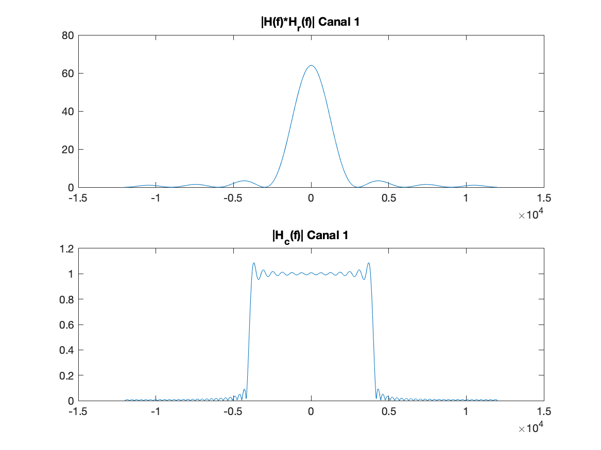
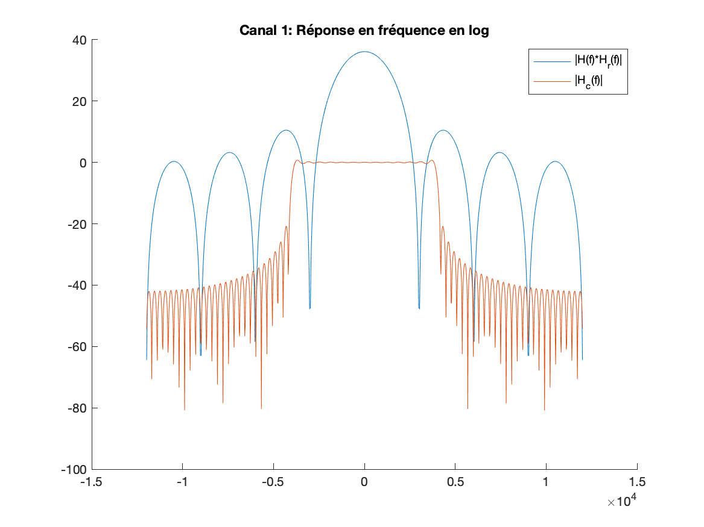

---
# pandoc -s rapport.md -o rapport.pdf --template eisvogel --listings
title: "Rapport - TP2 : Étude de l’interférence entre symbole et du critère de Nyquist"
subtitle: "Première année - Département Sciences du Numérique"
author: "[Julien Blanchon](mailto:julien.blanchon@etu.toulouse-inp.fr)"
date: "2 Mars 2020"
keywords: [telecom, matlab, signal]
lang: "fr-FR"
titlepage: true,
titlepage-rule-color: "360049"
titlepage-rule-height: 13
#titlepage-background: "figures/background10.pdf"
#logo: "figures/inp-enseeiht.png"
#logo-width: 65mm
#page-background: "figures/background1.pdf"

base: . %Base directory for import file

header-left: "\\hspace{1cm}"
header-center: "\\leftmark"
header-right: "Page \\thepage"
footer-left: "\\thetitle"
footer-center: ""
footer-right: "[© Julien Blanchon](mailto:julien.blanchon@etu.toulouse-inp.fr)"

subparagraph: true

output:
pdf_document:
    fontsize: 12pt #10, 11 ou 12pt seulement
    # mainfont: "Roboto"
    # sansfont: "Raleway"
    # monofont: "IBM Plex Mono"
    geometry: [a4paper, bindingoffset=0mm, inner=30mm, outer=30mm, top=30mm, bottom=30mm] # Voir https://ctan.org/pkg/geometry pour les options geometry

toc: true
toc-own-page : true
toc-title: Table des matières
toc_depth: 2
lot: false
lof: false

documentclass: article
...

# Étude sans canal de propagation : bloc modulateur/démodulateur

1. Expliquez comment sont obtenus les instants optimaux d’échantillonnage (permettant d’échantillonner sans interférences entre symboles) :
	- A partir du tracé de $g$:
	- A partir du tracé du diagramme de l’oeil en sortie du filtre de réception.

**A partir du tracé de $g$ : **
1. Canal 1:

    