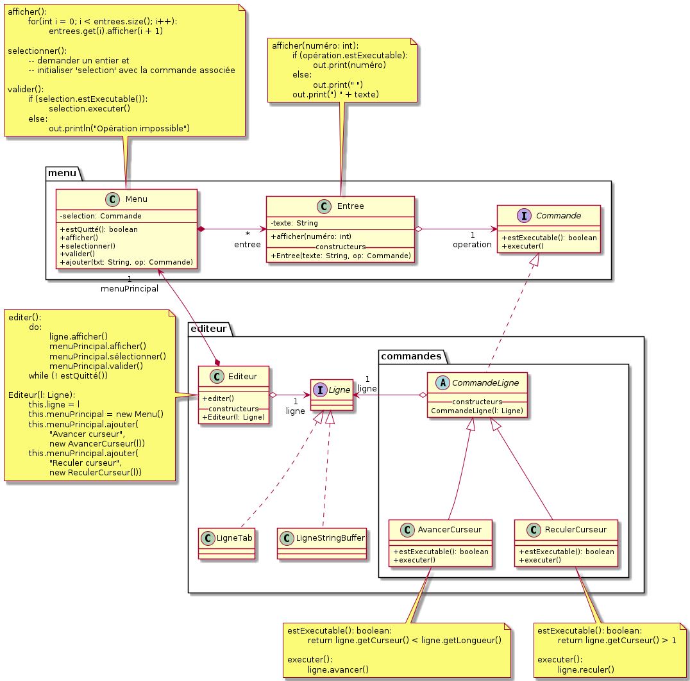

---
# pandoc -s reponse.md -o reponse.pdf --template eisvogel --listings
title: "Un éditeur orienté ligne"
subtitle: "TP 10"
author: "[Julien Blanchon](mailto:julien.blanchon@etu.toulouse-inp.fr)"
date: "1 Mars 2020"
keywords: [tob, java, midi, piano]
lang: "fr-FR"
titlepage: true,
titlepage-rule-color: "360049"
titlepage-rule-height: 13
#titlepage-background: "figures/background10.pdf"
#logo: "figures/inp-enseeiht.png"
#logo-width: 65mm
#page-background: "figures/background1.pdf"

base: . %Base directory for import file

header-left: "\\hspace{1cm}"
header-center: "\\leftmark"
header-right: "Page \\thepage"
footer-left: "\\thetitle"
footer-center: ""
footer-right: "[© Julien Blanchon](mailto:julien.blanchon@etu.toulouse-inp.fr)"

subparagraph: true

output:
pdf_document:
    fontsize: 12pt #10, 11 ou 12pt seulement
    # mainfont: "Roboto"
    # sansfont: "Raleway"
    # monofont: "IBM Plex Mono"
    geometry: [a4paper, bindingoffset=0mm, inner=30mm, outer=30mm, top=30mm, bottom=30mm] # Voir https://ctan.org/pkg/geometry pour les options geometry

toc: true
toc-own-page : true
toc-title: Table des matières
toc_depth: 2
lot: false
lof: false

documentclass: article
...

# Exercice 1 : Comprendre l’architecture de l’éditeur orienté ligne
L’application « éditeur orienté ligne » a été commencée. Il vous est demandé de la compléter.

## 1.1 Exécuter l’application

*Exécuter l’application.* Constater que le menu textuel est opérationnel.

Le menu textuel est bien opérationnel.

## 1.2. Comprendre l’architecture

*Comprendre l’architecture.* Vérifier que le code respecte le diagramme de classe fourni.



OK !

## 1.3. Compléter les commandes.

*Compléter les commandes.* Ajouter deux nouvelles commandes au menu. 
La première per- met de ramener le curseur sur le premier caractère de la ligne (touche « 0 » en vi). 
La seconde permet de supprimer le caractère sous le curseur (touche « x » en vi).

`editeur/commande/CommandeSupprimerSousCurseur.java` :
```java
package editeur.commande;

import editeur.Ligne;

/** Supprime le caractère sous le curseur. La position du curseur reste
 * inchangée.
 * @author	Julien Blanchon
 * @version	1.0
 */
public class CommandeSupprimerSousCurseur
        extends CommandeLigne
{

    /** Initialiser la ligne sur laquelle travaille
     * cette commande.
     * @param l la ligne
     */
    //@ requires l != null;	// la ligne doit être définie
    public CommandeSupprimerSousCurseur(Ligne l) {
        super(l);
    }

    public void executer() {
        ligne.supprimer();
    }

    public boolean estExecutable() {
        return ligne.getLongueur() > 0;
    }

}
```

`editeur/commande/CommandeCurseurDebut.java` :
```java 
package editeur.commande;

import editeur.Ligne;

/** Positionner le curseur au début de la ligne.
 * @author	Julien Blanchon
 * @version	1.0
 */
public class CommandeCurseurDebut
        extends CommandeLigne
{

    /** Initialiser la ligne sur laquelle travaille
     * cette commande.
     * @param l la ligne
     */
    //@ requires l != null;	// la ligne doit être définie
    public CommandeCurseurDebut(Ligne l) {
        super(l);
    }

    public void executer() {
        //while (ligne.getCurseur() != 0 ) {
        //    ligne.reculer();
        //}
        System.out.println(ligne.getCurseur());
        ligne.raz();
    }

    public boolean estExecutable() {
        return (ligne.getLongueur() > 0 && ligne.getCurseur() > 1);
    }
}
```

`editeur/EditeurLigne.java` :
```java 
	/** Initialiser l'éditeur à partir de la lign à éditer. */
	public EditeurLigne(Ligne l) {
		ligne = l;

		// Créer le menu principal
		menuPrincipal = new Menu("Menu principal");
		menuPrincipal.ajouter("Ajouter un texte en fin de ligne",
					new CommandeAjouterFin(ligne));
		menuPrincipal.ajouter("Avancer le curseur d'un caractère",
					new CommandeCurseurAvancer(ligne));
		menuPrincipal.ajouter("Reculer le curseur d'un caractère",
					new CommandeCurseurReculer(ligne));
		menuPrincipal.ajouter("Placer le curseur au début de la ligne",
				new CommandeCurseurDebut(ligne));
		menuPrincipal.ajouter("Supprimer le caractère sous le curseur",
				new CommandeSupprimerSousCurseur(ligne));
	}
```

# Exercice 2 : Ajouter des sous-menus

Pour organiser le grand nombre de commandes proposées par une application, il est utile de pouvoir organiser un menu en sous-menus. 
Par exemple, on décide de réorganiser le menu en regroupant dans un sous-menu spécifique les opérations relatives au curseur.

## 2.1. Définir des sous-menus.
*Définir des sous-menus.* 

Proposer une manière de réaliser cette notion de sous-menus. On ne modifiera pas la classe Menu.
On pourra envisager deux comportements pour le sous-menu : soit le sous-menu propose la sélection d’une seule opération et il
disparaît, soit il reste actif jusqu’à ce qu’il soit quitté explicitement par l’utilisateur.

